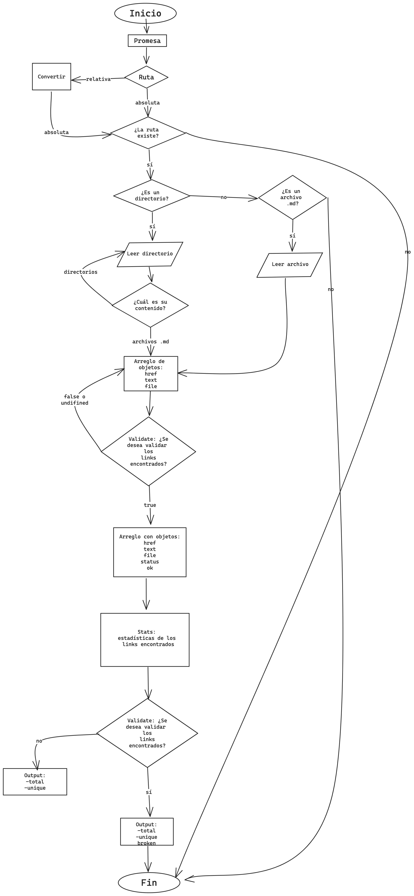
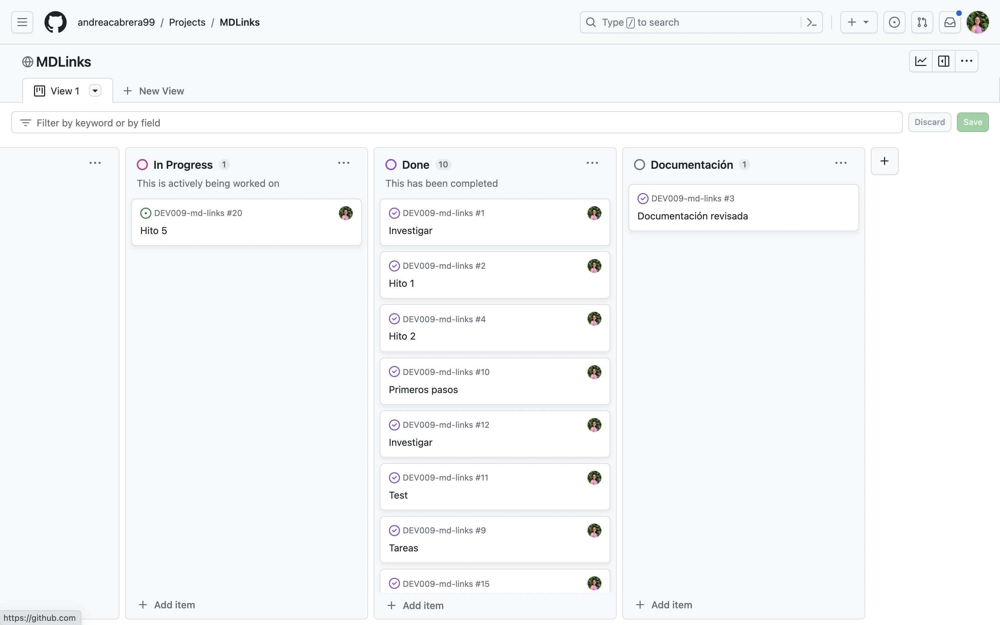

# Markdown Links

## Índice

* [1. Preámbulo](#1-preámbulo)
* [2. Resumen del proyecto](#2-resumen-del-proyecto)
* [3. Funcionalidades](#3-funcionalidades)
* [4. Instalación](#4-instalación)
* [5. Guía de uso](#5-guía-de-uso)
* [6. Descripción de los archivos del proyecto](#6-descripción-de-los-archivos-del-proyecto)
* [7. Diagrama de flujo](#7-diagrama-de-flujo)
* [8. Organización del proyecto](#8-organizació-del-proyecto)
* [9. Documentación](#9-documentación)

***

## 1. Preámbulo
Markdown es un lenguaje de marcado ligero que puede usar para agregar elementos de formato a documentos de texto sin formato. Creado por John Gruber en 2004, Markdown es ahora uno de los lenguajes de marcado más populares del mundo.

Markdown permite editar texto de manera sencilla y con archivos pequeños. Esta edición de texto se hace a partir de símbolos que anteceden o rodean al texto al que queremos dar formato. Por ello, es usado en muchísimas plataformas que manejan texto plano (GitHub, foros, blogs, etc.) y es muy común encontrar varios archivos en ese formato en cualquier tipo de repositorio (empezando por el tradicional README.md).

Sin embargo, estos archivos Markdown normalmente contienen links (vínculos/ligas) que muchas veces están rotos o ya no son válidos y eso perjudica mucho el valor de la información que se quiere compartir.

## 2. Descripción del proyecto
El proyecto mdlinks es una librería desarrollada con Node.js que sirve para leer y analizar archivos de formato Markdown con el fin de encontrar y verificar los links que contengan y reportar algunas estadísticas sobre ellos. 

En este sentido, la herramienta mdlinks está pensada para examinar todos los links existentes en los archivos md, detectar su estado y hacer fácil el hallazgo de enlaces repetidos, rotos y válidos. 


## 3. Funcionalidades
La librería mdlinks recibe como parámetro principal el nombre de un archivo o de un directorio. En caso de que el nombre pertenezca a una ruta relativa se transforma a una absoluta. Una vez transformada, mdlinks lee el contenido del archivo y devuelve un arreglo con todos los links del archivo o la carpeta, donde se incluyen los siguientes datos: href, texto y la ruta de donde viene el link. 

El usuario tiene parámetros opcionales, los cuales tienen diferentes funciones.
- `--validate` sirve para validar el estado del link, por lo que al arreglo original se agregan los datos de status, que contiene el código de respuesta HTTP, y ok, que dice ok o fail según corresponda el código. 
- `--validate --stats` retorna un objeto con la estadística que indica el conteo de links totales, únicos y rotos.
- `--stats` devuelve un objeto que contiene una estadística con el número total de links hallados, así como el número de links únicos.

## 4. Instalación
Para instalar la herramienta, se tiene que ejecutar el siguiente comando en la terminal.
 ```
 npm install andreacabrera99/DEV009-md-links
 ```

## 5. Guía de uso
Una vez instalada la librería, el usuario puede ejecutar el comando mdlinks en la terminal, junto con el nombre de la ruta del archivo o carpeta de la que quiere inspeccionar los links. 

 ```
 mdlinks 'nombre-de-ruta.md'
 ```

Es clave que se use este primer parámetro, ya que es obligatorio. Si no se entrega ninguna ruta, la herramienta devolverá el siguiente mensaje. 

 ```
'Error: se necesita un archivo'
 ```

Aparte de este primer parámetro hay parámetros opcionales. El primero es `--validate`, el cual agrega datos sobre el status de los links en la ruta. 

 ```
 mdlinks 'nombre-de-ruta.md' --validate
 ```

La segunda opción es `--stats`, la cual devuelve un objeto con estadísticas de los links totales y los no repetidos. 

 ```
 mdlinks 'nombre-de-ruta.md' --stats
 ```

Por último, se pueden combinar las dos anteriores: `--validate --stats` y con ello se obtiene una estadística que agrega la información de los links rotos en el archivo pasado.

 ```
 mdlinks 'nombre-de-ruta.md' --validate --stats
 ```


## 6. Descripción de los archivos del proyecto
* `data.js` tiene todas las funciones puras con las implementaciones de file system y path de node.js, axios y markdown-it.
* `index.js` corresponde a la Interfaz de línea de comando (CLI), es decir, que exporta y ejecuta la función `mdlinks()` con todos sus parámetros.
* `mdlinks.js` es el archivo con la función global `mdlinks()`, donde se exportan e implementan las funciones puras del archivo `data.js` para ejecutar todas las funcionalidades de la herramienta. 
* `package.json` contiene la información importante del proyecto: nombre, versión, descripción, autora, licencia, dependencias, scripts, main, bin.
* `test` es una carpeta que incluye los tests unitarios para la función `mdLinks()`, así como para las funciones puras contenidas en el archivo `data.js`. 
* Archivos y carpetas para ejecutar pruebas de la funcionalidad del proyecto: `files`, `md`, `links.md`, `broken-links.md`, `example.md`, `text.md`.

## 7. Diagrama de flujo
El proyecto se basa en un proceso lógico compuesto por diferentes pasos, el cual se desglosa en el siguiente diagrama de flujo. 



## 8. Organización del proyecto
Para la organización del proyecto, se utilizó el siguiente board en [Github Projects](https://github.com/users/andreacabrera99/projects/2), donde se llevó a cabo la planeación del flujo de trabajo a través de milestones y issues en torno a la división de tareas según los cinco hitos sugeridos.



## 9. Documentación 
- [Promesas de JavaScript: una introducción](https://web.dev/i18n/es/promises/#whats-all-the-fuss-about)
- [Promesa](https://es.javascript.info/promise-basics)
- [How to Write a JavaScript Promise](https://www.freecodecamp.org/news/how-to-write-a-javascript-promise-4ed8d44292b8/)
- [Promise](https://developer.mozilla.org/es/docs/Web/JavaScript/Reference/Global_Objects/Promise)
- [Formas de manejar la asincronía en JavaScript](https://carlosazaustre.es/manejando-la-asincronia-en-javascript)
- [Acerca de Node.js](https://nodejs.org/es/about#acerca-de-nodejs)
- [¿Qué es Nodejs? Javascript en el Servidor](https://www.youtube.com/watch?v=WgSc1nv_4Gw)
- [¿Qué es Node.js y para qué sirve?](https://www.drauta.com/que-es-nodejs-y-para-que-sirve)
- [What exactly is Node.js?](https://www.freecodecamp.org/news/what-exactly-is-node-js-ae36e97449f5)
- [package.json](https://docs.npmjs.com/cli/v10/configuring-npm/package-json)
- [Tú, yo y package.json](https://medium.com/noders/t%C3%BA-yo-y-package-json-9553929fb2e3)
- [JavaScript Modules in 100 Seconds](https://www.youtube.com/watch?v=qgRUr-YUk1Q)
- [CommonJS en Dos Minutos (más o menos)](https://www.youtube.com/watch?v=97qak8k0HMU)
- [Require vs Import Javascript](https://www.youtube.com/watch?v=mK54Cn4ceac&t=494s)
- [¿Qué es un framework de testing? | Pruebas en JavaScript](https://www.youtube.com/watch?v=p-ChRclzpGY) 
- [¿Cómo escribo tests/pruebas con Jest? | Pruebas en JavaScript](https://youtu.be/hlEpqK4ovgY?si=AbadYFwWU1fkuXpF)
- [Aserciones con expect() de Jest | Pruebas en JavaScript](https://youtu.be/6NE47G7MwYY?si=Z64NeDKPOAIo8NVD)
- [Generalidades del protocolo HTTP](https://developer.mozilla.org/es/docs/Web/HTTP/Overview)
- [Mensajes HTTP](https://developer.mozilla.org/es/docs/Web/HTTP/Messages)
- [Códigos de estado de respuesta HTTP](https://developer.mozilla.org/es/docs/Web/HTTP/Status)
- [The Complete Guide to Status Codes for Meaningful ReST APIs](https://dev.to/_staticvoid/the-complete-guide-to-status-codes-for-meaningful-rest-apis-1-5c5)
- [Cómo hacer peticiones http en JavaScript](https://luisrrleal.com/blog/como-hacer-peticiones-http-en-javascript)
- [Axios js tutorial in 120 seconds](https://www.youtube.com/watch?v=j284YeATTAI)
- [Axios - npm ](https://www.npmjs.com/package/axios?activeTab=readme)
- [EL SCOPE en JAVASCRIPT](https://www.youtube.com/watch?v=s-7C09ymzK8)
- [Node.js fs.readdirSync() Method](https://www.geeksforgeeks.org/node-js-fs-readdirsync-method/)
- [Rutas de archivos y directorios en Node.js (Path)](https://medium.com/@diego.coder/rutas-de-archivos-y-directorios-en-node-js-path-c294002fc176)
- [Píldora recursión](https://www.youtube.com/watch?v=lPPgY3HLlhQ)
- [Recursión o Recursividad](https://medium.com/laboratoria-developers/recursi%C3%B3n-o-recursividad-ec8f1a359727)
- [Promise.all()](https://developer.mozilla.org/es/docs/Web/JavaScript/Reference/Global_Objects/Promise/all)
- [A guide to creating a NodeJS command-line package](https://medium.com/netscape/a-guide-to-create-a-nodejs-command-line-package-c2166ad0452e)
- [Recursión y pila](https://es.javascript.info/recursion)